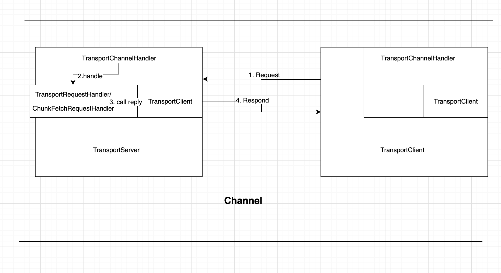

# TransportContext

TransportContext 是Spark 网络通信模块重要的类，具体介绍其中的几个重要方法
其中包含构造`TransportServer`, `TransportClientFactory`的内容， 同时在分别构造服务端和客户端的时候，
设置Netty Channel的pipeline `org.apache.spark.network.server.TransportChannelHandler`

在Transport中TransportClient 提供两种通信协议`control-plane RPCs`和`data-plane "chunk fetching"`. 
处理RPCs不再TransportContext的控制范围内，而是使用客户端定制的Handler 比如 NettyEnvRpcHandler。
同时，他提供使用令0拷贝的stream数据层交互。
`TransportServer` 和 `TransportClientFactory` 都会为每一个通讯channel创建 `TransportChannelHandler`。
每一个`TransportChannelHandler`包含一个`TransportClient`,使服务端也可以向已存在的客户端发送消息。




## 主要API


### createClientFactory()
初始化一个在返回客户端之前，使用给定TransportClientFactory的ClientFactory。
BootStraps将同步执行，并且必须成功运行才能创建客户端。

### createServer()

初始化TransportServer

### initializePipeline()

初始化一个client 或者 server 的Netty Channel Pipeline ， 这个pipeline可以 encodes/decodes 消息
并且又一个 `org.apache.spark.network.server.TransportChannelHandler`去处理请求或者响应
   
返回创建的TransportChannelHandler，其中包括一个可用于在此通道上通信的TransportClient。
TransportClient直接与ChannelHandler关联，以确保同一通道的所有用户获得相同的TransportClient对象。

```java
public TransportChannelHandler initializePipeline(
      SocketChannel channel,
      RpcHandler channelRpcHandler) {
    try {
      TransportChannelHandler channelHandler = createChannelHandler(channel, channelRpcHandler);
      ChunkFetchRequestHandler chunkFetchHandler =
        createChunkFetchHandler(channelHandler, channelRpcHandler);
      ChannelPipeline pipeline = channel.pipeline()
        // 发送消息的加密
        .addLast("encoder", ENCODER)
        .addLast(TransportFrameDecoder.HANDLER_NAME, NettyUtils.createFrameDecoder())
        // 接收消息解码
        .addLast("decoder", DECODER)
        .addLast("idleStateHandler",
          // 当一个channel 一段时间没有读写时间，触发超时事件
          new IdleStateHandler(0, 0, conf.connectionTimeoutMs() / 1000))
        // NOTE: Chunks are currently guaranteed to be returned in the order of request, but this
        // would require more logic to guarantee if this were not part of the same event loop.
        .addLast("handler", channelHandler);
      // chunk消息的特殊性，需要使用独立的EventLoopGroup去处理保证逻辑完整
      // 处理ChunkFetchRequest的独立线程池。这有助于限制在通过底层通道将
      // ChunkFetchRequest消息的响应写回客户机时阻塞的TransportServer工作线程
      // 的最大数量。
      // Use a separate EventLoopGroup to handle ChunkFetchRequest messages for shuffle rpcs.
      if (chunkFetchWorkers != null) {
        pipeline.addLast(chunkFetchWorkers, "chunkFetchHandler", chunkFetchHandler);
      }
      return channelHandler;
    } catch (RuntimeException e) {
      logger.error("Error while initializing Netty pipeline", e);
      throw e;
    }
  }

```
### createChannelHandler()

创建服务器端和客户端处理程序，用于处理请求消息和响应消息。虽然某些属性(如remoteAddress())可能还不可用，
但是预期通道已经成功创建。

### createChunkFetchHandler()
为ChunkFetchRequest消息创建专用的ChannelHandler。