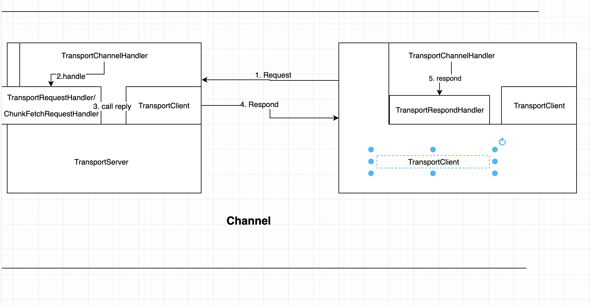

# TransportContext

TransportContext 是Spark 网络通信模块重要的类，具体介绍其中的几个重要方法
其中包含构造`TransportServer`, `TransportClientFactory`的内容， 同时在分别构造服务端和客户端的时候，
设置Netty Channel的pipeline `org.apache.spark.network.server.TransportChannelHandler`

在Transport中TransportClient 提供两种通信协议`control-plane RPCs`和`data-plane "chunk fetching"`. 
处理RPCs不再TransportContext的控制范围内，而是使用客户端定制的Handler 比如 NettyEnvRpcHandler。
同时，他提供使用令0拷贝的stream数据层交互。
`TransportServer` 和 `TransportClientFactory` 都会为每一个通讯channel创建 `TransportChannelHandler`。
每一个`TransportChannelHandler`包含一个`TransportClient`,使服务端也可以向已存在的客户端发送消息。

## initializePipeline